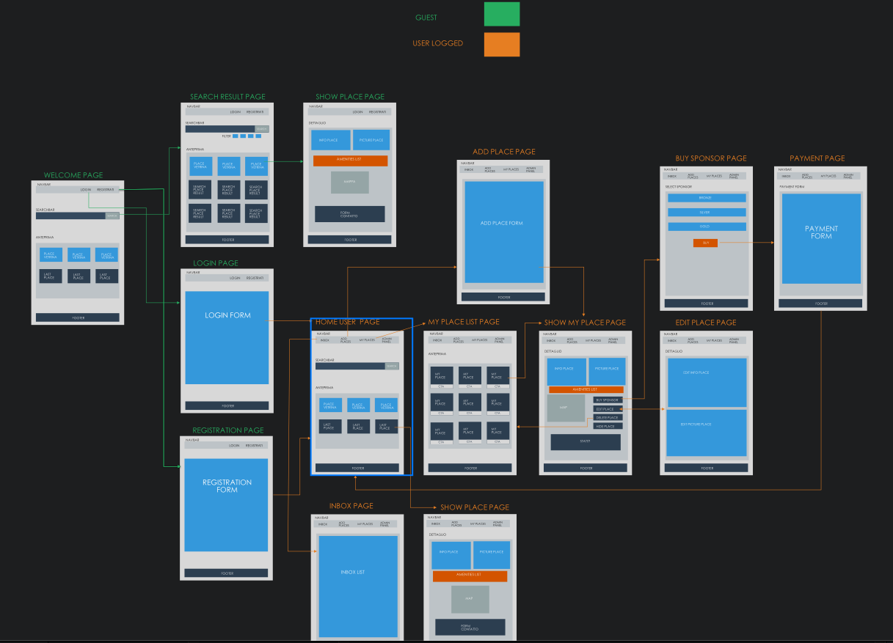

#   BOOLBNB 

> 

>

> ##### *:open_file_folder: File Name\:  Boolbnb :open_file_folder:*

>

> 

****Project:**** 

BoolBnB è una applicazione per trovare e gestire l’affitto di appartamenti.

Attraverso BoolBnB i proprietari di appartamento possono inserire le informazioni degli appartamenti che vogliono affittare per cercare utenti interessati.

Gli utenti che vogliono mettere in affitto un appartamento devono registrarsi alla piattaforma; una volta registrati hanno la possibilità di inserire uno o più appartamenti.

Gli utenti interessati ad un appartamento, utilizzando i filtri di una apposita pagina di ricerca, vedono una lista di possibili appartamenti e cliccando su ognuno possono vedere una pagina di dettaglio.

Una volta trovato l’appartamento desiderato, l’utente interessato può contattare l’utente proprietario per fare domande.

Inoltre, i proprietari di un appartamento possono decidere di pagare per sponsorizzare l’annuncio del proprio appartamento per fare in modo che il loro annuncio sia maggiormente in evidenza rispetto a quelli non sponsorizzati.

### :computer: Languages and Libraries:

* HTML

* CSS

* SASS

* Bootstrap

* JS

* jQuery

* Chart Js

* Leaflet Js

* Algolia (Places/Scout/Autocomplete/Instasearch Js)

* Braintree

* Ajax

* Handlebars

* MySql

* PHP

* Laravel

* Carbon

### :desktop_computer: Anteprima Progetto:

Progetto Realizzato tramite Sketch & Invision App:

****Preview Dekstop :desktop_computer: :****

****Preview Mobile :iphone:	:****

